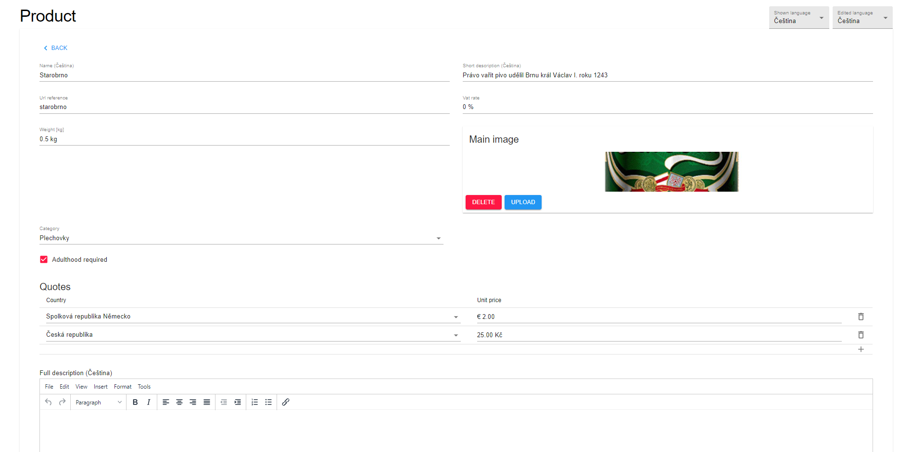

@bast1oncz/entities
--------------------------
This library offers complex features and a specific workflow with entities. 
This means frontend entities (javascript objects) but remote entities (graphql objects) as well.
Conceptionally, it is not an problem to implement other remote services as well.

Take example of this complex entity: Product.


All of this was generated using just this code:
````
function ProductDetailPage() {
    const {id} = useParams()
    
    const categoryOptions = useProductCategoryOptions()
    const countryOptions = useCountryOptions()
    
    return (
        <DetailPage
            id={id}
            type={id ? DetailType.UPDATE_DETAIL : DetailType.CREATE_DETAIL}
            listRoute="PRODUCT_LIST"
            detailRoute="PRODUCT_DETAIL"
            loading={!categoryOptions || !countryOptions}
            entityFragment={ProductFragmentDoc}
            filterName="ProductFilterInput"
            autoCreate
        >
            <Grid container spacing={4}>
                <Grid item md={6}>
                    <TranslatedStringField sourceKey={nameSourceKey} label="Name" validate={translatedNameValidator}/>
                </Grid>
                <Grid item md={6}>
                    <TranslatedStringField sourceKey={shortDescriptionSourceKey} label="Short description"
                                           validate={translatedShortDescriptionValidator}/>
                </Grid>
                <Grid item md={6}>
                    <StringField sourceKey="urlReference" label="Url reference" validate={urlReferenceValidator}/>
                </Grid>
                <Grid item md={6}>
                    <NumberField sourceKey="vatRate" label="Vat rate" format={PERCENT_FORMAT} validate={vatValidator} />
                </Grid>
                <Grid item md={6}>
                    <NumberField sourceKey="weight" label="Weight [kg]" validate={requiredValidator}
                                 format={WEIGHT_FORMAT}/>
                </Grid>
                <Grid item md={6}>
                    <ImageField sourceKey="mainImage" label="Main image" deletable/>
                </Grid>
                <Grid item md={6} container spacing={2}>
                    <Grid item xs={12}>
                        <SelectField sourceKey="category" label="Category"
                                     options={categoryOptions} deletable/>
                    </Grid>
                    <Grid item xs={12}>
                        <BooleanField sourceKey="adulthoodRequired" label="Adulthood required"/>
                    </Grid>
                </Grid>
                <Grid item xs={12}>
                    <ItemListField sourceKey="quotes" label="Quotes" orderable>
                        <SelectField sourceKey="country" label="Country" options={countryOptions}
                                     validate={requiredValidator}/>
                        <NumberField sourceKey="unitPrice.value" updateKey="unitPrice" label="Unit price"
                                     format={currencyFormat}
                                     validate={requiredValidator}/>
                    </ItemListField>
                </Grid>
                <Grid item xs={12}>
                    <TranslatedHtmlField sourceKey={fullDescriptionSourceKey} label="Full description" />
                </Grid>
            </Grid>
            <DetailActions>
                <DetailDeleteEntity/>
            </DetailActions>
        </DetailPage>
    )
}
````

### Sync Concept
This library uses sync concept, so that every change by user is immediately synchronized with the store place of an entity.
If an error occurs, user can lose **maximum of 1 filled field's work**.
Aditionally, the storage place (such as **api**) can contain more **complex logic** to change other entity fields, which is immediately loaded on the frontend side.

### Advantages
* Do not let user lose data
* Generate interactive entity editation environments
* Generate them fast
* Do not solve repetitive form bugs, because they were already solved for you
* Save your time 


### Dependencies
The library is mainly based on **react** and **@bast1oncz pack**.

### Usage
The use of this library is **FREE**, but the dependencies are private packages. If you'd like to try it, please contact me at my [email](mailto:mir.klobaska@seznan.cz).
